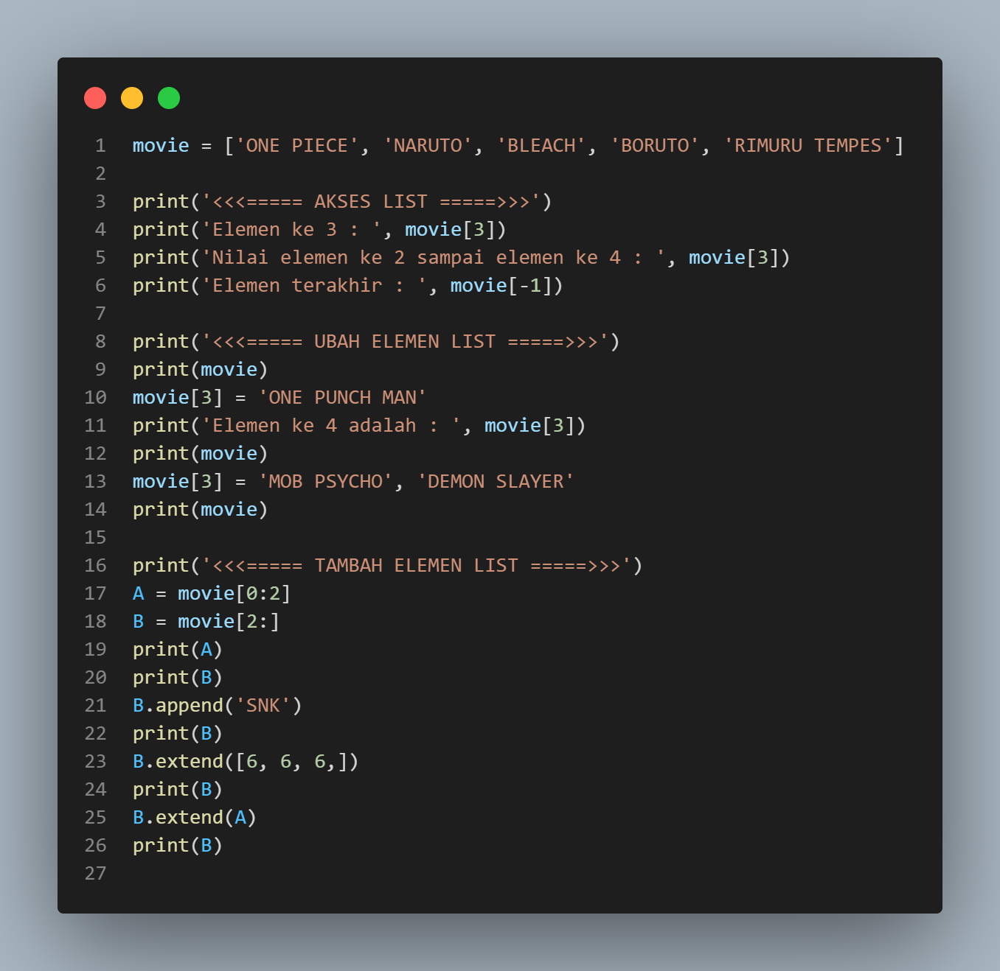
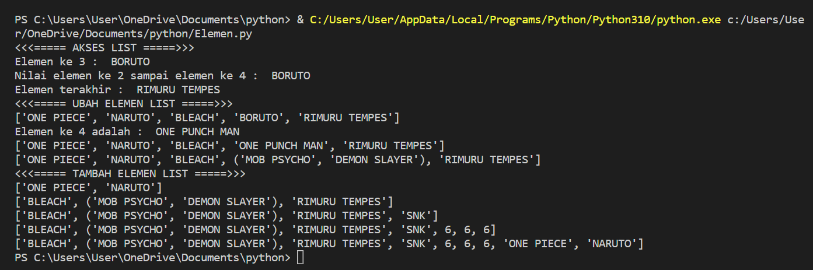
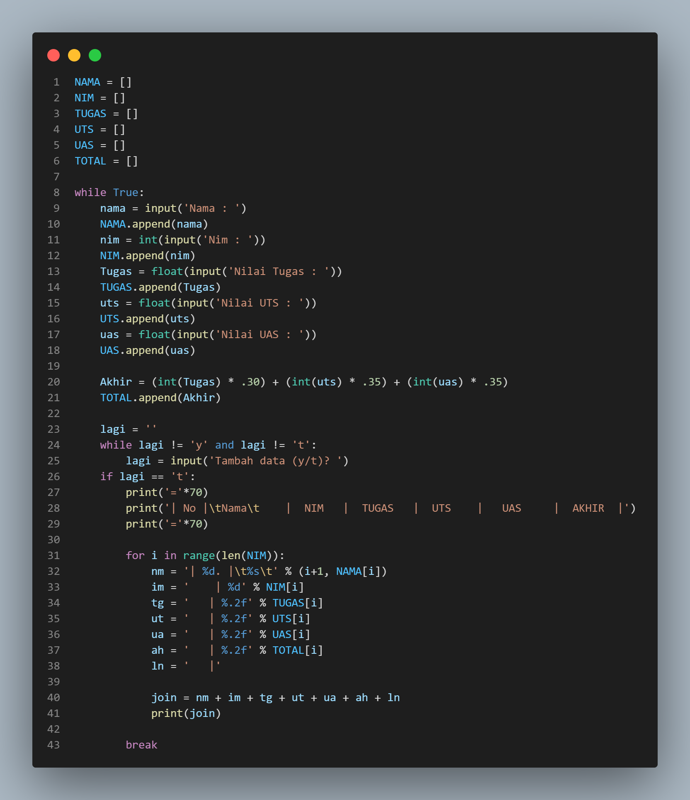
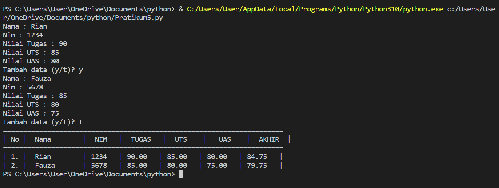
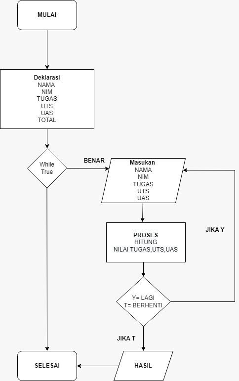

# Latihan

- Buat sebuah list sebanyak 5 elemen dengan nilai bebas
- akses list:
- tampilkan elemen ke 3
- ambil nilai elemen ke 2 sampai elemen ke 4
- ambil elemen terakhir
- ubah elemen list:
- ubah elemen ke 4 dengan nilai lainnya
- ubah elemen ke 4 sampai dengan elemen terakhir
- tambah elemen list:
- ambil 2 bagian dari list pertama (A) dan jadikan list ke 2 (B)
- tambah list B dengan nilai string
- tambah list B dengan 3 nilai
- gabungkan list B dengan list A

# Tampilan program

# Tugas Praktikum

# Buat program sederhana untuk menambahkan data kedalam sebuah list dengan rincian sebagai berikut:

- Progam meminta memasukkan data sebanyak-banyaknya (gunakan perulangan)
- Tampilkan pertanyaan untuk menambah data (y/t?), apabila jawaban t (Tidak), maka program akan menampilkan daftar datanya. 
- Nilai Akhir diambil dari perhitungan 3 komponen nilai (tugas: 30%, uts: 35%, uas: 35%)

# Tampilan program

# flowchart dan penjelasan programnya

                                                             
                                                             
                                                             Terima Kasih (><)
